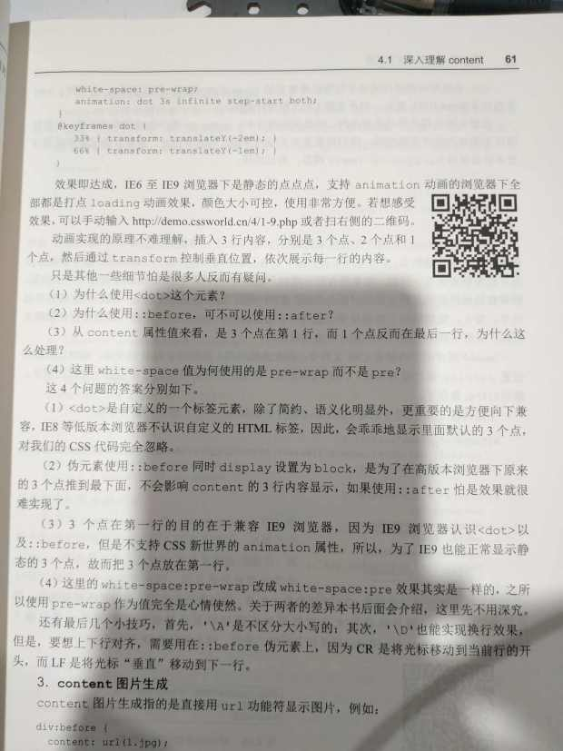
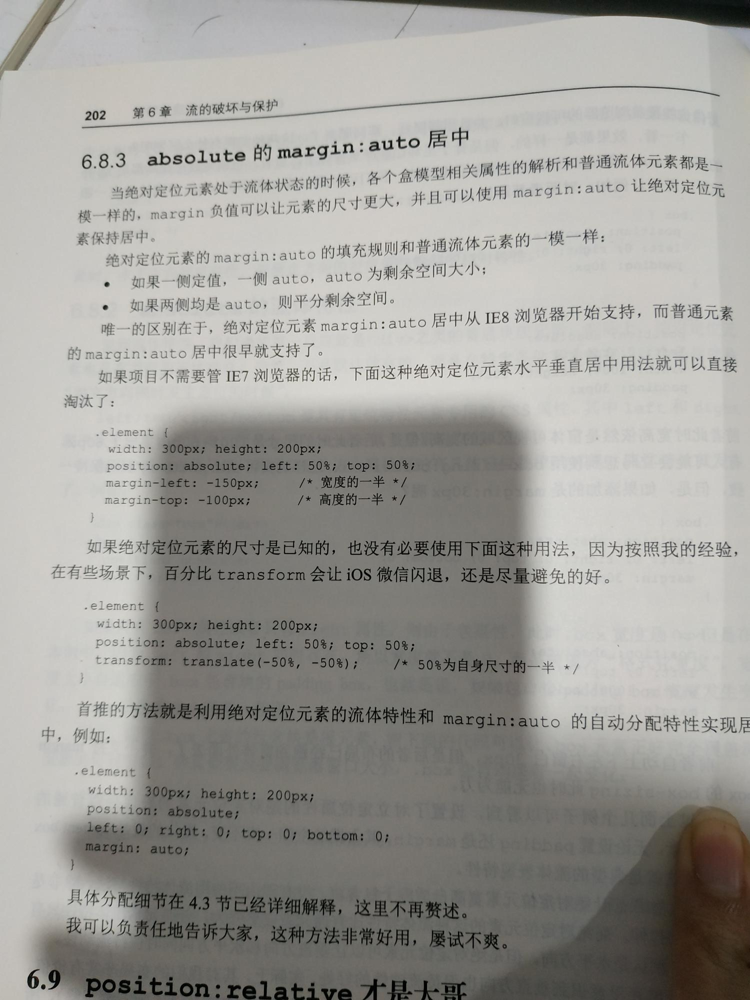

http://demo.cssworld.cn/3/2-5.php

凹凸效果 http://demo.cssworld.cn/3/2-6.php

任意高度元素的展开收起动画技术（max-height） http://demo.cssworld.cn/3/3-2.php

src缺省时img元素的alt信息展示 http://demo.cssworld.cn/4/1-2.php

普通元素content属性变成替换元素 http://demo.cssworld.cn/4/1-5.php

content换行符与打点loading效果 http://demo.cssworld.cn/4/1-9.php


内联元素padding与高度可控的分隔线 http://demo.cssworld.cn/4/2-2.php

百分比padding值与等比例头图 http://demo.cssworld.cn/4/2-3.php

padding实现三道杠和双层圆点 http://demo.cssworld.cn/4/2-4.php

margin负值与等高布局 http://demo.cssworld.cn/4/3-2.php

border绘制与color变色 http://demo.cssworld.cn/4/4-1.php

优雅增加点击区域之搜索框清除按钮 http://demo.cssworld.cn/4/4-2.php

基于ex单位的天然垂直居中对齐效果 http://demo.cssworld.cn/5/1-1.php

利用inline-block基线原理的小图标对齐 http://demo.cssworld.cn/5/3-7.php

基于vertical-align的纯CSS定位弹框 http://demo.cssworld.cn/5/3-10.php

focus锚点定位和overflow的选项卡切换 http://demo.cssworld.cn/6/4-3.php

一个absolute就能实现定位 http://demo.cssworld.cn/6/5-4.php

居中


z-index负值与纸张卷边阴影模拟 http://demo.cssworld.cn/7/6-2.php

letter-spacing与字符动效 http://demo.cssworld.cn/8/6-4.php 

(小技巧：读取offsetwidth值强制reflow来触发动画)
```js
  document.querySelector('.title').addEventListener('click', function () {
    if (this.classList) {
      this.classList.remove('title');
      //强制reflow，不然删除class立马添加class会被浏览器优化，不触发动画
      this.offsetWidth;
      this.classList.add('title');
    }
  });
```
其他讨论：http://gxcsoccer.github.io/blog/2012/09/04/how-to-stop-css3-transition/ https://www.cnblogs.com/fsjohnhuang/p/9143035.html

white-space:nowrap与水平列表切换 http://demo.cssworld.cn/8/6-6.php

“蝉原则”与CSS3随机多背景随机圆角等效果 https://www.zhangxinxu.com/wordpress/2017/02/cicada-principle-css3-randomisation-multiple-backgrounds-border-radius/