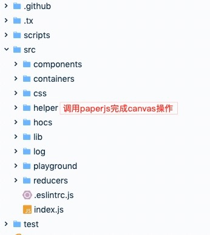

## 核心
整个项目核心是基于canvas标签，而canvas用了paperjs这个库来操作，它能把canvas上的图形像对象一样操作，例如var a = new Path()这种操作就可创建一条新路径，a也可以绑定鼠标事件,做一些操作。其他就是利用react来响应各种用户操作，比如工具栏上的一些icon点击响应，然后调用paperjs来完成操作；

## 项目结构
典型的redux结构，components和container分开维护。store主要维护编辑器图像的所有状态（以支持撤销，重做）和工具栏的一些状态（颜色设置，画笔粗细等）；help文件夹中的方法是核心，主要是调用paperjs 的一些方法完成相应操作。

## 主要流程
- 1.canvas初始化：paper-canvas组件(本质是个canvas)装载后调用paperjs的setup方法初始化
- 2.生成核心图层：backgroundGuideLayer 背景方格子；guidelayer：高亮图形的路径；paintLayer：画新图形生成在这层；rasterLayer: 栅格层，位图模式主要是在这层编辑
- 3.编辑：调用各个help里的tool方法，使用paperjs的方法实现功能
- 4.编辑操作完成：顶层组件可拿到编辑后的图像，和旋转中心数据，供其他用途，在慧编程中，会显示到舞台的canvas里
