# 关键渲染路径资源优化

参考来源：http://t.75team.com/video/play?id=65_260_2017032010370819aadb47-c79c-4d63-afd4-df0b42eaee48

## 浏览器渲染原理
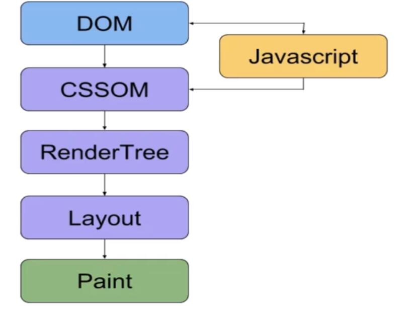

浏览器无需等待HTML加载完毕，便可以开始解析DOM（增量构建）

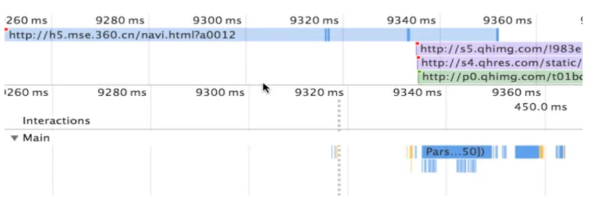

### CSS DOM
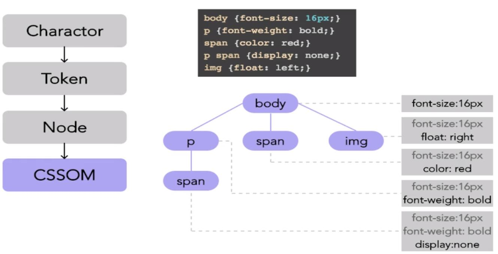

### RenderTree
- RenderTree包含了渲染网页所需的节点
- 无需渲染的几点不会被添加到RenderTree中。如display:none

### Layout
计算渲染树节点的位置大小

以下会出发layout
- 屏幕旋转
- 浏览器视窗改变
- 与大小位置相关的css属性改变（csstriggers.com）

使用chrome开发者工具可以方便查看渲染性能，以下为注意点
- 禁用缓存，以便测试首次浏览性能
- 使用隐身模式，防止拓展干扰
- 模拟真实网络情况
- chrome canary

## 资源对渲染的影响

### CSS阻塞初次渲染
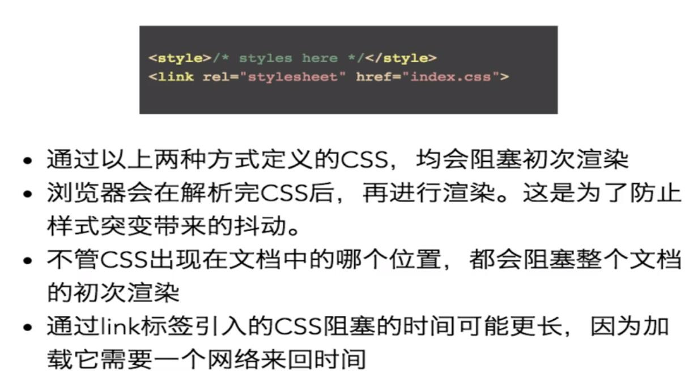

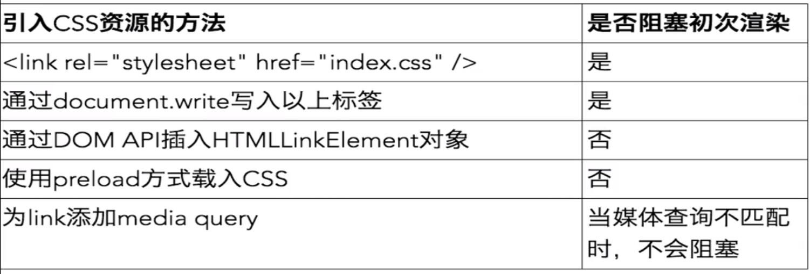

### js阻塞HTML Parser

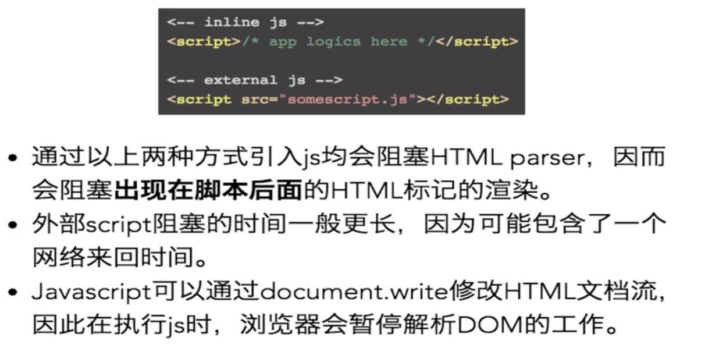

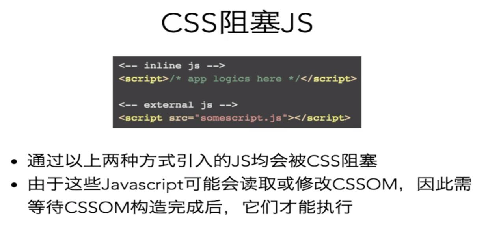

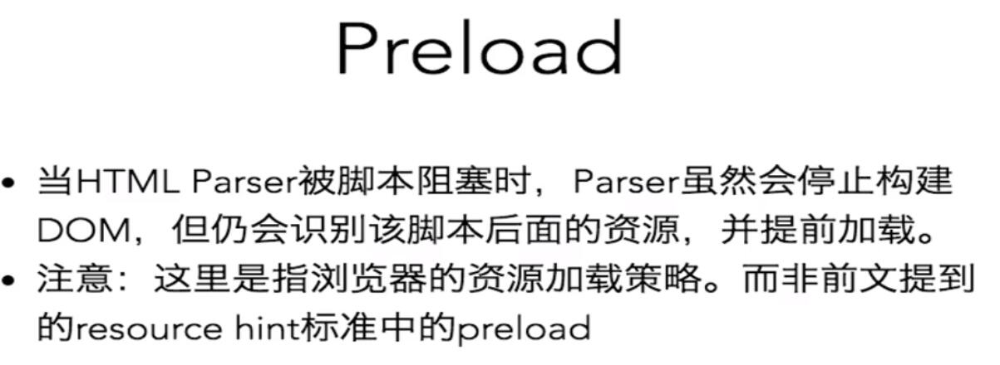

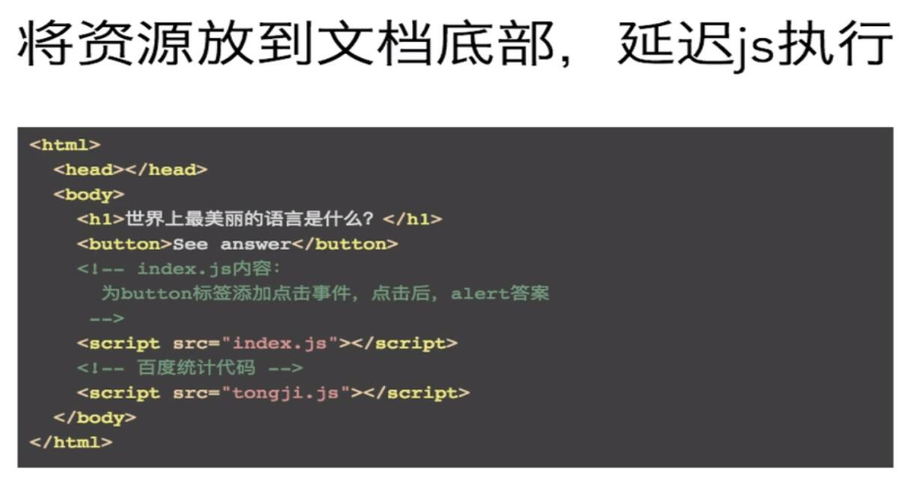

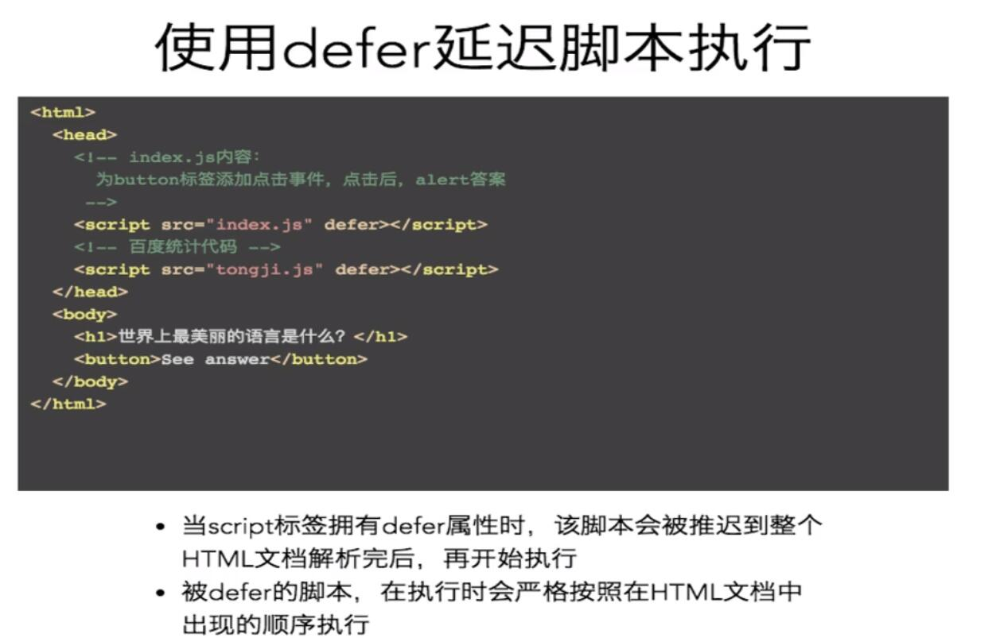

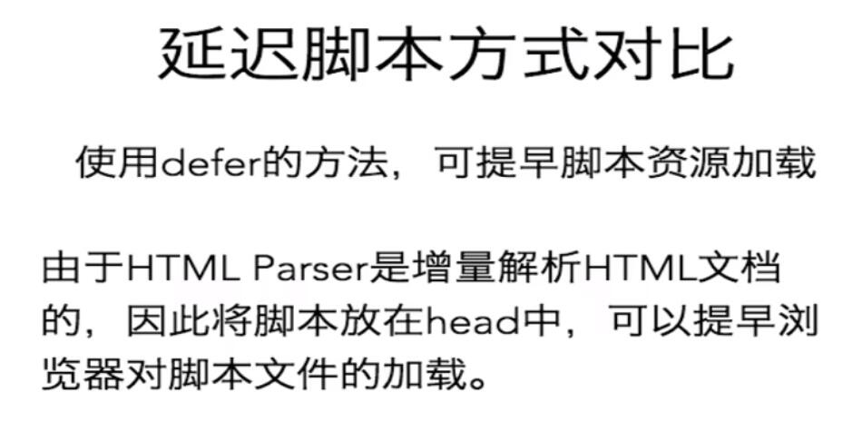

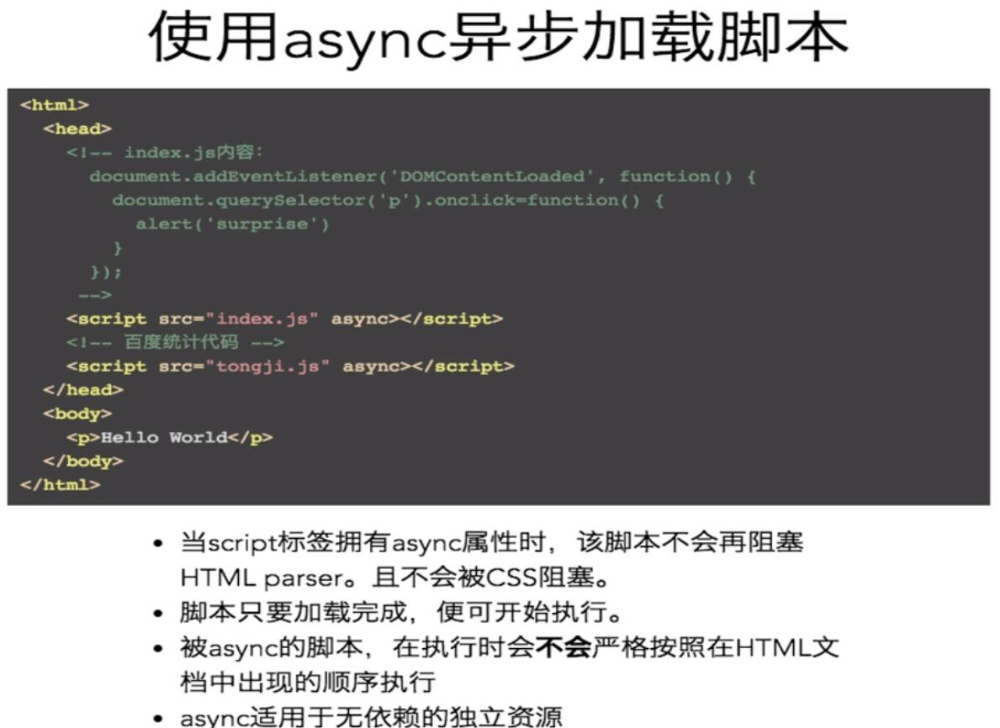

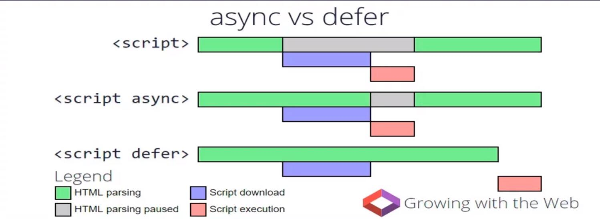

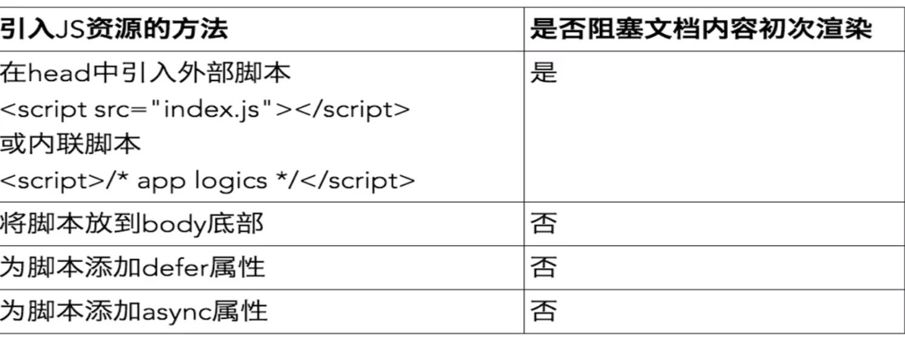

### Font阻塞内容渲染
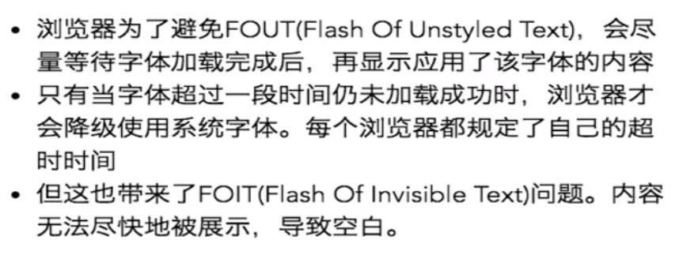

## 优化目标
讲一下指标压缩到最低
- 关键资源数
- 关键资源体积
- 关键资源体积来回数

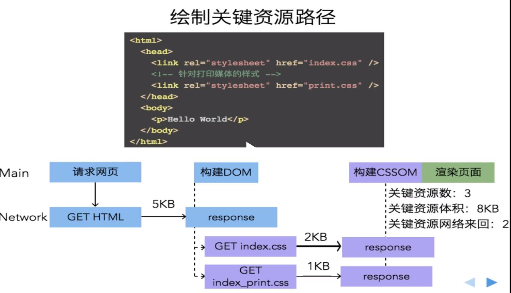
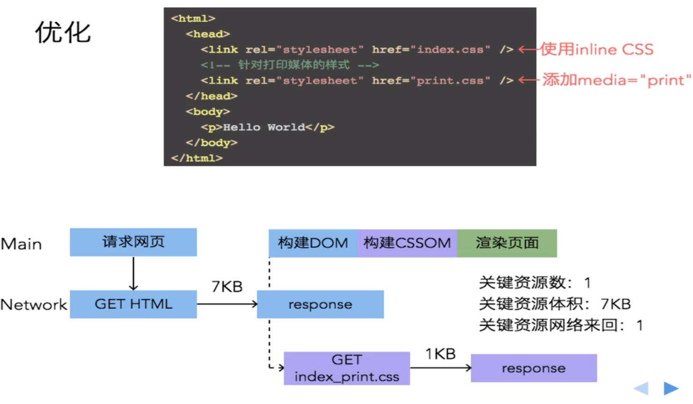
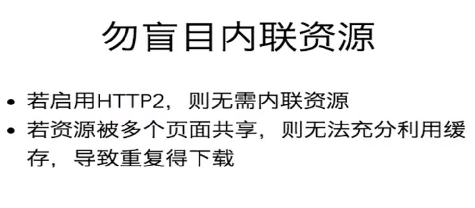
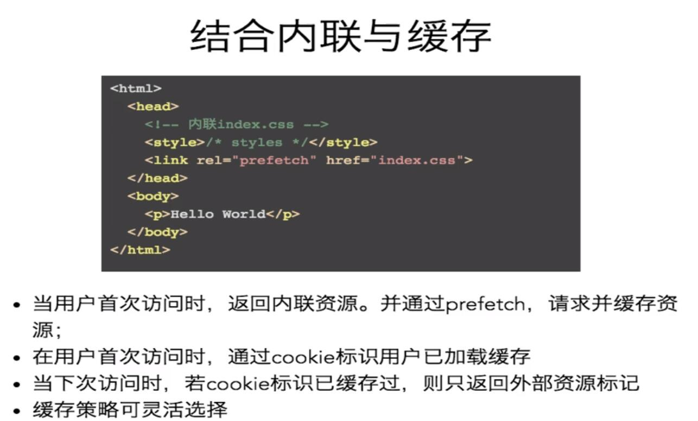

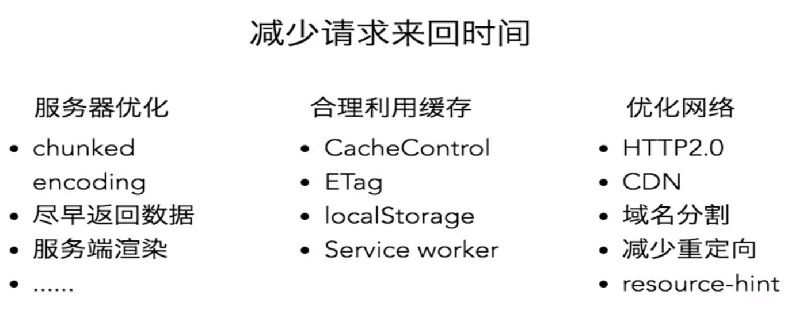
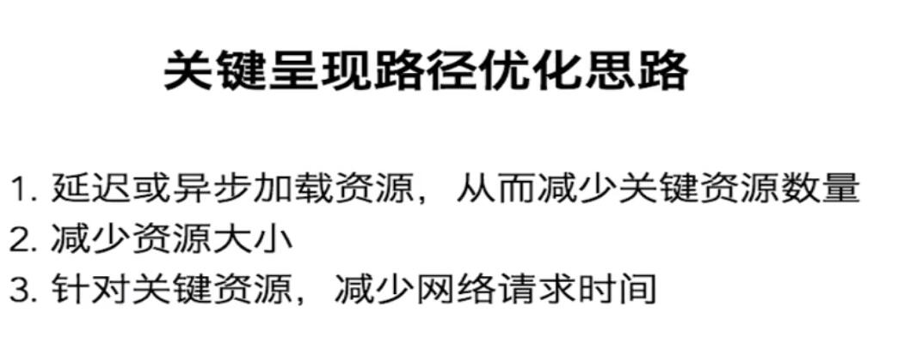

## 学习资源
https://developers.google.com/speed/pagespeed/insights/?hl=zh-CN

https://developers.google.com/web/tools/chrome-devtools/evaluate-performance/

http://perf.rocks